# I/O _(LHQ 25.1)_

## 简述

- I/O 指的是 `input 和 output`。
- I/O 是一切实现的基础。
- 分为 `标准 I/O (stdio)` 和 `系统调用 I/O (sysio 或 文件 I/O)`。
- 当两种 I/O 都能用的时候，优先使用 `标准 I/O`。
  - 优先使用 `标准 I/O`的理由：
    - 可移植性好。
    - 合并了系统调用（多数情况下是好事）（stdio 依赖于 sysio 来实现）。

## errno 各个值的具体含义和定义 _(LHQ 25.2)_

- `errno` 早期被定义为一个整型变量，现在已经把它的概念私有化重构为宏了。
- 验证 `errno` 现在已经被私有化重构为宏了
  - [示例：errno-is-macro v1](./Atta/code/1001-errno-is-macro/README.md#v1)

- `/usr/include/asm-generic/errno-base.h`
- `/usr/include/asm-generic/errno.h`

## stdio (标准 I/O)

- `FILE` 类型始终贯穿始终。
- `man 3 XXX`
- [面试题：判断并说明为什么](./19001.LHQ题.md#判断并说明为什么-lhq-252)

### `fopen(3)` 和 `fclose(3)` _(LHQ 25.2 25.3 25.4)_

- [示例：fopen(3) 的基本使用 v1](Atta/code/1010-fopen-and-errno/README.md#v1)

### `fgetc(3)` 和 `fputc(3)` _(LHQ 25.5)_

- [示例：简单的 copy 程序实现 v1](./Atta/code/1020-my-copy/README.md#v1)
- [示例：计算一个文件的大小 v1](./Atta/code/1030-count-file-size/README.md#v1)

### `fgets(3)` 和 `fputs(3)` _(LHQ 25.6)_

- 读取到 size - 1 或读取到 '\n' 会结束，size - 1 是为了给 '\0' 留地方。
- 如果 size 为 5， 一个文件内容为 "abcd"，那么需要读取两次才能读完，因为文件中 "abcd" 的后面一
    定还有一个 '\n'，第一次读取四个字符 abcd 为 "abcd\0"，第二次读取这个 '\n' 为 "\n\0"。
- [示例：简单的 copy 程序实现 v2](./Atta/code/1020-my-copy/README.md#v2)

### `fread(3)` 和 `fwrite(3)` _(LHQ 25.6)_

- `fread(buff, size, number, fp)`：从 fp 流读取 number 个 size 大小的对象放入 buff 中。返回值为
    成功读取的对象个数。
  - 情况一：fp 有足够的数据
    - `fread(buff, 1, 10, fp)`
      - 返回值为 10，读取了 10 个字节
    - `fread(buff, 10, 1, fp)`
      - 返回值为 1，读取了 10 个字节
  - 情况二：fp 只有 5 个字节
    - `fread(buff, 1, 10, fp)`
      - 返回值为 5，读取了 5 个字节
    - `fread(buff, 10, 1, fp)`
      - 返回值为 0，文件中还有多少个字节不能确定，从 1~9 都可以
  - 结论：尽量使用 `fread(buff, 1, 10, fp)` 这种方式 即：当做 `fgetc(3) 和 fputc(3)` 来使用。但是
      不是说 `fread(buff, 10, 1, fp)` 这种方式不能使用，要看情况，需要读取或写入的数据特别工整，
      不能有一点的不规范。

- [示例：简单的 copy 程序实现 v3](./Atta/code/1020-my-copy/README.md#v3)

### `printf(3)` 和 `scanf(3)` 族 _(LHQ 25.7)_

- `printf(3) fprintf(3) dprintf(3) sprintf(3) snprintf(3)`
- `scanf(3) fscanf(3) sscanf(3)`

### 文件位置指针操作

- `fseek(3)` 和 `ftell(3)` _(LHQ 25.9)_
  - 缺陷：这两个函数的参数或返回值使用了 `long` 类型，那么文件位置指针的移动就只能在 `long` 型范
      围内，大概就是 2G 大小，即：2G 内的文件使用这两个函数没问题，但是超过 2G 的文件使用这两个函数
      就不行了。
  - [示例：计算一个文件的大小 v2](./Atta/code/1030-count-file-size/README.md#v2)

- `fseeko(3)` 和 `ftello(3)` _(LHQ 25.8)_
  - 这两个函数用来代替 `fseek(3)` 和 `ftell(3)`，修正了它们的缺陷（具体要看系统实现，看 man 手册）。
      但是这两个函数不属于 C 标准，所以需要考虑可移植性问题。

- `rewind(3)` _(LHQ 25.9)_
- `fgetpos(3)`
- `fsetpos(3)`

### `fflush(3)` _(LHQ 25.9)_

- 标准输出是行缓冲。
- 缓冲区的作用：
  - 缓冲区的存在大多数情况下是好事，作用是合并系统调用。
  - 行缓冲：换行时或缓冲区满了或强制刷新时才进行缓冲区刷新（例如：标准输出（因为是终端设备））。
  - 全缓冲：缓冲区满了或强制刷新时才进行缓冲区刷新（全缓冲为默认模式，只要其不是终端设备）。
  - 无缓冲：如 `stderr`，需要立即输出的内容。
  - `setvbuf(3)` 可以修改缓冲模式。

### `getline(3)` _(LHQ 25.10)_

- 对该函数使用的参数一定要做初始化。
- 该函数内部是使用 `malloc(3)` 和 `realloc(3)` 封装的。
- 该函数会发生一点内存泄漏（可控的、影响比较小的），因为该函数用到了动态内存申请，但是没有提供内
    存释放相关的函数。虽然可以手动的进行 `free(3)`，但是不推荐使用，因为动态内存申请的方式不只有
    `malloc(3)`，还有其他的申请方法，这里可以使用 `free(3)` 手动释放是因为我们知道该函数是使用
    `malloc(3)` 和 `realloc(3)` 实现的，但是如果面对我们不知道某个函数申请内存使用的是哪种方式或者
    说以后的新版本中 `getline(3)` 内部改用非 `malloc(3)` 实现了，那我们用的 `free(3)` 就会导致未知
    问题。

- [示例：获取一个文件每行有多少个字符 v1](./Atta/code/1040-count-line-size/README.md#v1)

### 临时文件：_(LHQ 25.11)_

- `tmpnam(3)` 和 `tmpfile(3)` 和 `mkstemp(3)`
  - 尽量避免使用 `tmpnam(3)`，因为该函数是非原子的。
  - 尽可能用 `mkstemp(3)` 或 `tmpfile(3)`。

## sysio (系统调用 I/O) _(LHQ 26.1)_

- 文件描述符（fd）是在 sysio 中贯穿始终的类型。

### 文件描述符的概念 _(LHQ 26.1)_

- 文件描述符图示

  

- 文件描述符的数组是存放在每个进程空间内的。
- 文件描述符实际是一个整型数（一个数组的下标）。
- 文件描述符优先使用当前可用范围内最小的。

### sysio 操作

- `open(2)` 和 `close(2)` _(LHQ 26.2)_
- `read(2)` 和 `write(2)` _(LHQ 26.3)_
- [示例：简单的 copy 程序实现 v4](./Atta/code/1020-my-copy/README.md#v4)
- `lseek(2)`
- `fileno(3)` _(LHQ 26.4)_
- `fdopen(3)` _(LHQ 26.4)_
- `truncate(2)` _(LHQ 26.5)_
- `ftruncate(2)` _(LHQ 26.5)_

### sysio 与 stdio 的区别 _(LHQ 26.4)_

- 举例说明：传达室老大爷跑邮局发邮件

- 区别：
  - `sysio` 的响应速度快
  - `stdio` 的吞吐量大
  - [面试题：如何使一个程序变快](./19001.LHQ题.md#如何使一个程序变快-lhq-264)

- 注意：`sysio` 和 `stdio` 函数不可混用（因为 stdio 有缓冲区存在）(stdio FILE \* 指向的结构体和
  sysio 文件描述符代表的指针指向的结构体一般是不一样的)。
- [示例：stdio 和 sysio 不要混用 v1](./Atta/code/1050-only-stdio-or-sysio/README.md#v1)

### I/O 的效率问题 _(LHQ 26.5)_

- 习题：
  - 测试修改 [示例：简单的 copy 程序实现 v4](Atta/code/1020-my-copy/README.md#v4) 中的 `BUFF_SIZE`
    的值（从 1 开始翻倍（或者从 128 开始翻到 16M（应该会段错误，若没有那么继续翻倍））），
    测试当这个值为多少的时候执行（拷贝）效率最高？使用 `time ./main XXX ~/zzz` 测试程序消耗的时间
    （使用个大文件，比如 2G 多的电影文件）。

### 文件共享 _(LHQ 26.5)_

- 文件共享：多个任务共同操作一个文件或者协同完成任务。
- [面试题：写程序删除一个文件的第 10 行](./19001.LHQ题.md#写程序删除一个文件的第-10-行-lhq-265)

### 原子操作 _(LHQ 26.6)_

- 原子操作：不可分割的操作。
- 作用：解决竞争和冲突。
- 比如：
  - `tmpnam(3)` 就不是原子操作
  - `tmpfile(3)` 是原子操作

### 程序中的重定向 _(LHQ 26.6)_

- `dup(2)`
- `dup2(2)`
- [示例：使用 dup(2) 和 dup2(2) 重定向 stdout v1](./Atta/code/1060-dup-dup2/README.md#v1)

### 同步 _(LHQ 26.7)_

- `sync(2)`：全局催促，在关机或解除挂载设备的时候常用。(内核层面的）
- `fsync(2)`
- `fdatasync(2)`

### `fcntl(2)` 和 `ioctl(2)` _(LHQ 26.7)_

- `fcntl(2)`：文件描述符相关的魔术都来自该函数，是个管家级别的函数，功能复杂多样
- `ioctl(2)`：也是个管家级别的函数，设备相关的内容大多归该函数管理

### `/dev/fd/` 目录 _(LHQ 26.7)_

- `/dev/fd/` 目录是一个虚目录，显示的当前进程的文件描述符信息
