# 文件系统 _(LHQ 27.1)_

## 目录和文件 _(LHQ 27.1)_

- [面试题: 命令行使用 `touch` 命令创建一个名字为 `-a` 的文件](./19001.LHQ题.md#命令行使用-touch-命令创建一个名字为--a-的文件-lhq-271)

### 获取文件属性 _(LHQ 27.2)_

- `stat(2)` 和 `fstat(2)` 和 `lstat(2)`
  - `stat(2)` : 通过文件路径获取属性, 面对符号链接文件时获取的是符号链接所指向目标文件的属性
  - `fstat(2)` : 通过文件描述符获取属性
  - `lstat(2)` : 面对符号链接文件时获取的是符号链接文件的属性

- [示例: 计算一个文件的大小 v3](./Atta/code/1030-count-file-size/README.md#v3) _(LHQ 27.3)_
- [示例: 创建一个空洞文件 v1](./Atta/code/1070-empty-file/README.md#v1) _(LHQ 27.3)_

### 文件访问权限 _(LHQ 27.4)_

- `int stat(const char *pathname, struct stat *statbuf)`
  - `statbuf.st_mode` : `mode_t` 类型, 是一个 16 位位图, 用于表示文件类型、文件访问权限和特殊权限位.

- 文件类型
  - `d` : directory 目录文件
  - `c` : character device 字符设备文件
  - `b` : block 块设备文件
  - `-` : regular 常规文件
  - `l` : link 链接文件(这里只是指符号链接文件)
  - `s` : socket 网络套接字 socket 文件
  - `p` : pipe 管道文件(这里指的是命名管道, 因为匿名管道在磁盘上是看不到的)
  - [示例: 探测一个文件的类型 v1](./Atta/code/1080-get-file-type/README.md#v1) _(LHQ 27.4)_

### umask _(LHQ 27.5)_

- `umask值` 的存在是为了防止产生权限过松的文件.
- `umask(2)`

### 文件权限的更改(管理) _(LHQ 27.5)_

- `chmod(2)` 和 `fchmod(2)`

### 粘住位 _(LHQ 27.5)_

- `t 位` :
  - 原本的意思: 若给一个二进制可执行文件设置了 t 位, 会在内存中保留该可执行文件的使用痕迹, 为的是在
    下次装载该可执行文件时会比较快. (现在这个设计已经没用了, 因为有了 page cache 的设计, 常用的数据
    已经被留在内存中了).
  - 现在的用途: 常用在给目录设置 t 位, 比如 `/tmp` 目录, **作用待查**

### 文件系统布局原理

- 文件系统: 文件或数据的存储和管理
- `FAT` 和 `UFS`: 基本是同一个时期的产物.

#### FAT 文件系统 _(LHQ 27.5)_

- 非开源
- 静态存储的单链表
- FAT 文件系统图示:

  

#### UFS 文件系统性 _(LHQ 27.6)_

- 开源
- Unix 早期的文件系统, 相当于 ext2 文件系统
- UFS 文件系统图示:

  

### 硬链接和符号链接 _(LHQ 27.7)_

- 硬链接与目录项是同义词, 且建立硬链接有如下限制: 不能给分区建立, 不能给目录建立.
- 符号链接的有点: 可以跨分区, 可以给目录建立.
- 硬链接相当于在目录文件中增加了一条目录项.(相当于两个 iNode 指向同一个数据块链)
- 符号链接文件和源文件各自拥有自己的文件属性信息.
- 创建硬链接
  - `ln src_file dest_file`

- 创建符号链接
  - `ln -s src_file dest_file`

- `link(2)` `unlink(2)` `remove(3)` `rename(2)`

### 更改时间(utime) _(LHQ 27.7)_

- `utime(2)` : 更改的是访问和修改的时间.
  - `Access time` : 访问时间
  - `Modify time` : 修改时间(对文件内容进行修改)
  - `Change time` : 状态改变时间(文件属性更改)
  - `Birth time` : 创建时间(相当于 EXTFS 的 crtime)), 非 POSIX 标准, 需用 `statx(2)` 获取

### 目录的创建和销毁 _(LHQ 27.7)_

- `mkdir(2)`
- `rmdir(2)`

### 更改当前工作路径 _(LHQ 27.7)_

- `chdir(2)` 和 `fchdir(2)` : 可以突破假根技术(chroot)(骗进程或子进程当前工作路径就是根目录)
- `getcwd(2)`

### 分析目录(读取目录内容)

- 解析目录(非递归)
  - 方法一 _(LHQ 28.1 28.2)_
    - `glob(3)` `globfree(3)` : 解析模式(通配符).
    - 注意: 若 `glob(3)` 返回值为 `GLOB_NOMATCH` (即: 3), 为没有匹配项,(即: 目录为空或要匹配的文件
      不存在, 正常现象, 为假错误)
    - [示例: 解析目录(非递归) v1](./Atta/code/1090-directory-parse/README.md#v1) _(LHQ 28.2)_
    - [示例: 解析目录(非递归) v2](./Atta/code/1090-directory-parse/README.md#v2) _(LHQ 28.2)_
  - 方法二(组合使用, 把当前目录当做一个流来处理) _(LHQ 28.1 28.2)_
    - `opendir(3) fdopendir(3)` `closedir(3)` `readdir(3)` `rewinddir(3)` `seekdir(3)` `telldir(3)`
    - [示例: 解析目录(非递归) v3](./Atta/code/1090-directory-parse/README.md#v3) _(LHQ 28.2)_

- 解析目录(递归) _(LHQ 28.3 28.4)_
  - [示例: 解析目录(递归) v1](./Atta/code/1100-my-du/README.md#v1) _(LHQ 28.3 28.4)_
  - [示例: 解析目录(递归) v2](./Atta/code/1100-my-du/README.md#v2) _(LHQ 28.4)_

## 系统数据文件和信息 _(LHQ 28.5)_

### `/etc/passwd` 文件 _(LHQ 28.5)_

- 并不是每个系统都有该文件. 比如在早期 FreeBsd 就没有该文件, 它使用的是一个非关系型的小型数据
  库 BDB 来存储这些信息. 再比如 HP 小型机 的UNIX 也没有该文件, 它使用的是里用文件系统进行存储, 在一
  个目录中使用了 26 目录或文件, 每个文件或目录对应 26 个字母, 对应每个用户名的首字母, 里面存储了这
  些用户的信息.
- `/etc/passwd` 中每条记录对应图示:

  

- `getpwnam(3)` `getpwuid(3)`
- [示例: 根据 uid 获取对应的用户名 v1](./Atta/code/1101-passwd/README.md#v1) _(LHQ 28.5)_

### `/etc/group` 文件 _(LHQ 28.6)_

- 同 `/etc/passwd` 文件一样, 不是每个系统都有 `/etc/group` 文件
- `getgrnam(3)` `getgrgid(3)`

### `/etc/shadow` 文件 _(LHQ 28.6)_

- `/etc/shadow` 中每条记录对应图示:

  
- `hash 哈希` : 不能实现加密(最起码不能单纯使用哈希进行加密), 它实现的是混淆, 哈希是不可逆的. 既然
  是加密, 就对应着有解密, 哈希不能解密. 比如: `x % 5 = 2`, x 相当于被加密, 对 5 求余相当于进行哈
  希, 2 相当于哈希后的结果, 从 2 计算得不到 x, 即: 张三出了一个题说我有一个数对 5 求余, 结果
  为 2, 问我这个数是多少? 给不出一个唯一确切的答案, 因为 x 有可能为 n 多个数, 比如 2、7、12 17 ...
  (但是很多加密方法都是用类似哈希的方法来实现的这种封装出的哈希函数实现的, 甚至加密效果的好坏取决于
  该加密算法对哈希函数封装的好坏. 一般来说一个好的加密算法, 当加密口令有一个字符改变时, 被加密过的
  文件应该有一半以上的内容被改变了). 如果单纯用哈希进行加密, 如果张三用口令 x 对串 a 进行哈希加密,
  得到加密后的串 b, 若李四使用的口令和张三一样也是对串 a 进行哈希加密, 那么这二人得到的加密后的结果
  是一样的, 这样就要防备管理员监守自盗了(例如: 假设一个银行对用户的密码使用的是哈希加密, 某天管理员
  在后台偶然发现有两个人或几个人经过加密后的取钱密码是一样的, 那么这个管理员去和其中一人 a 套近乎,
  而 a 口风不紧, 两杯酒下肚就把取钱密码告诉这个管理员了, 那么这几个人在该银行都是使用的同一个密码(
  因为使用的是哈希加密), 可以猜测这几个人各自在其他银行也是使用的这个密码, 此时管理员就可以去其他银
  行碰撞这些人的账户进行取钱). 所以哈希加密不能用于真正的加密, 好的加密算法应该是对同一个串进行两次
  同样口令的加密得到的结果串也应该是不同的.
- 加密最重要的是安全, 而计算机中没有绝对的安全, 因为使用穷举法早晚能进行解密. 所以有了一些防止被穷
  举解密的方法, 比如口令的随机校验(在某些情况下进行两次或多次密码验证, 即: 第一次输入的密码即使是正
  确的, 也显示密码错误让重新输入, 这种方式是为了应对脚本穷举解密攻击, 一般脚本进行穷举解密时每个密
  码都只尝试一次, 若报错就继续试下一个, 这样遇到随机校验即使某次测试的密码是正确的也会被走过去. 比
  如张三从来没在凌晨登陆网银, 突然某天凌晨张三的网银被登陆了且要把钱都转走, 此时让输入转账密码的时
  候就可能会触发随机校验). 再比如连续输入密码错误几次后账户会锁定一段时间才能再次尝试登录(也是为了
  应对穷举解密攻击).

- 安全: 攻击成本大于收益.

- MD5 加密的方式已经被山东一个大学教授给研究出了一种快速碰撞解密的方法(比如以前进行碰撞解密需要十天,
  而使用此方法可以大量缩减碰撞时间, 可能两三天就碰撞解密成功). 有一些常用函数(比较早的, 在快速碰撞方
  法没出现前编写的)在封装的时候默认就使用的是 MD5 加密, 使用这些函数的时候需要改参数或改方法.

- `《应用密码学》`

- `getspnam(3)` `getspent(3)` `crypt(3)` `getpass(3)`  _(LHQ 28.7)_

- [示例: 校验用户密码 v1](./Atta/code/1102-check-passwd/README.md#v1)  _(LHQ 28.7)_

### 时间戳 _(LHQ 28.8)_

- 各时间函数之间的关系图示

  

- `time(2)` `gmtime(3)` `localtime(3)` `mktime(3)` `gettimeofday(2)` `clock_gettime(2)`
  `strptime(3)` `strftime(3)` `strftime_l(3p)`

- [示例: 每秒向文件写入时间戳 v1](./Atta/code/1103-time-log/README.md#v1) _(LHQ 28.9 28.10)_
- [示例: 获取一百天以后的日期 v1](./Atta/code/1104-get-100day-later/README.md#v1) _(LHQ 28.10)_

## 进程环境 _(LHQ 28.11)_

### `main()` 函数 _(LHQ 28.11)_

- 早期的 `main()` 函数实际有三个参数, 第三个参数是环境变量, 后来把环境变量做成了线程的机制, 这里就不
  需要了.

### 进程的终止(非常重要) _(LHQ 28.11)_

- C 程序的启动和终止图示: _(LHQ 28.12)_

  

- 正常终止 **(需记住)**
  - 从 `main()` 函数 `return X`
    - 该返回值给当前进程的父进程的. 若一个进程(程序)是从 shell 启动的, 那么该进程的父进程就是
      shell, 可以使用 `echo $?` 命令来查看该进程结束时给其父进程 shell 的返回值. _(LHQ 28.12)_
    - 若 `main()` 函数末尾没有使用 `return X` 之类的语句, 则最后一条语句的返回值就是该进程的返回值. _(LHQ 28.11)_
      - [面试题: 判断程序结束时给父进程的返回值](./19001.LHQ题.md#判断程序结束时给父进程的返回值-lhq-2811)
  - `exit(3)`
    - 其返回给父进程的值(该函数的参数)只能有 256 种(从 -128 到 127), 看 man手册. 该函数在执行时会
      先把使用了 `atexit(3)` 和 `on_exit(3)` 进行注册了的所有函数按注册时的逆序顺序进行逐一调用,
      并进行 I/O 清理  _(LHQ 28.12)_
  - `_exit(2)` 或 `_Exit(2)`
    - 不会执行钩子函数和 I/O 清理. _(LHQ 28.12)_
  - 最后一个线程从其启动例程返回(即: 一个进程里面的最后一个线程结束)
  - 最后一个线程调用了 `pthread_exit(3)`

- 异常终止 **(需记住)**
  - 调用了 `abort(3)`
  - 接到一个信号并终止
  - 最后一个线程对(信号)其取消请求作出响应

- `atexit(3)` 钩子函数 _(LHQ 28.12)_
  - 注册一个函数, 该函数在进程正常终止之前会被调用.
  - 可以依次注册多个函数, 在进程正常终止之前会按注册顺序的逆序进行逐一调用.
  - [示例: 钩子函数的使用 v1](./Atta/code/1105-hook-function/README.md#v1) _(LHQ 28.12)_

### 命令行参数的分析 _(LHQ 28.13)_

- `getopt(3)` `getopt_long(3)`
- [示例: 解析命令行参数 v1](./Atta/code/1106-my-date/README.md#v1) _(LHQ 28.13 28.14)_

### 环境变量 _(LHQ 28.15)_

- 指的是程序进程空间的环境变量.
- 使用 `export` 命令可以获取当前用户的全部环境变量, 每条环境变量的格式是 `KEY=VALUE`.
- 使用 `export KEY=VALUE` 设置当前终端用户的环境变量(临时), 例如: `export LANG=en`, 此时用 `export`
  查看当前用户的环境变量会发现 `LANG` 还是原来的值, 并有被修改, 只是临时修改了当前用户使用的
  terminal 的环境变量.

- [示例: 输出所有的环境变量 v1](./Atta/code/1107-print-environ/README.md#v1) _(LHQ 28.15)_

- `getenv(3)` `setenv(3)` `unsetenv(3)`
  - [示例: 获取环境变量值 v1](./Atta/code/1108-get-environ-value/README.md#v1) _(LHQ 28.15)_
  - `setenv(3)` 是修改或添加一个环境变量, 若原本存在则修改, 否则为添加.
    - 添加或修改时不是原位置改变的(当原值串很长, 修改为短串没问题. 当原值串很短, 修改为长串就会内存
      写入越界), 是把环境变量原来的内容释放掉, 在堆上新申请一块空间存放新的值.

- `putenv(3)` : (了解即可, 不是特别好用)

### C 程序的存储空间布局 _(LHQ 28.16)_

- 32 位 Linux 系统中 C 程序的存储空间布局图示:

  

- `pmap` 命令: 查看一个正运行中进程的虚拟内存空间使用和分布情况, 例如 `pmap 65003`(65003 为进程号)

### 库 _(LHQ 28.16)_

- 动态库
- 静态库
- 共享库(手工装载库)(动态模块的加载)
  - `dlopen(3)` `dlclose(3)` `dlerror()` `dlsym()`
    - 编译时需追加编译参数: `-ldl`
    - man 手册中有示例代码
    - `void *` 可以转换给任何类型, 这里是唯一一个例外, 即: 在 C99 标准中规定将 `void *` 转换为一个函
      数指针类型是未定义的行为(查看 man 手册示例代码有注释说明).

### 函数跳转 _(LHQ 28.17)_

- `goto` : 不能跨函数跳转. (一般说不安全尽量不要用, 实际上如果使用了不会让代码变得恶劣, 那就用)
- `setjmp(3)` `longjmp(3)` `sigsetjmp(3)` `siglongjmp(3)`
  - 安全的跨函数跳转(只有一种情况需要做铺垫才能跳转, 后面补)
  - `setjmp(3)` 和 `sigsetjmp(3)` 返回值为 0 代表设置跳转点, 如果为非 0 值代表是从 `longjmp(3)` 或
    `siglongjmp(3)` 跳转回来的. (可以理解为 `setjmp(3)` 函数执行一次返回两次).
  - `longjmp(3)` 和 `siglongjmp(3)` 无返回, 其第二个参数带回给 `setjmp(3)` 作为 `setjmp(3)` 的返回
    值, 该值必须设置为非 0 值(若给它个 0, 它会自动修正为 1).

- [示例: setjmp 和 longjmp 的使用 v1](./Atta/code/1109-use-setjmp-longjmp/README.md#v1) _(LHQ 28.17 28.18)_

### 资源的获取和控制 _(LHQ 28.18)_

- `ulimit -a` : 查看对于一个进程资源的限制设定.
- `ulimit -? XXX` : 临时修改对于一个进程资源的限制设定. (`-?` 中的 `?` 可使用 `ulimit -a` 查看)
- `getrlimit(2)` `setrlimit(2)`
  - 软限制(rlim_t rlim_cur)不能超过硬限制(rlim_t rlim_max).
  - 普通用户可以降低和提高软限制(不能超过硬限制), 不能提高硬限制, 只能降低.
  - root 用户可以降低和提高软限制(不能超过硬限制), 可以提高和降低硬限制.
