# 网络编程 _(LHQ 35)_

## 跨主机的传输要注意的问题 _(LHQ 35.1)_

### 字节序问题

- 大端存储: 低地址处放高字节.
- 小端存储: 低地址处放低字节(x86 多是小端存储).
- 大小端数据存储图示:

  
- 文件传输和 I/O 传输时, 永远是低地址处的数据先出去, 高地址处的数据后出去.
- 网络传输不区分大小端字节序, 而是区分主机字节序和网络字节序.
  - 主机字节序: host
  - 网络字节序: network
  - X to X X:
    - htons: host to network short (主机字节序到网络字节序, 两字节(16 位)大小的).
    - htonl: host to network long (主机字节序到网络字节序, 四字节(32 位)大小的).
    - ntohs: network to host short (网络字节序到主机字节序, 两字节(16 位)大小的).
    - ntohl: network to host long (网络字节序到主机字节序, 四字节(32 位)大小的).

### 对齐问题

- 编译器为了加速节省取址周期, 一般会对结构体地址进行对齐, 而凡是参与了网络通信的结构体一定要记得禁止
  结构体对齐. 在编写与网络通信有关的结构体时一定要告诉编译器该结构体不要进行地址对齐.

### 类型长度的问题 _(LHQ35.2)_

- 不同系统(16位, 32 位, 64位)系统间的类型长度可能是不同的, 在不同的系统间进行网络通信时可能对某个类
  型的长度有不同的解析.
  - 在编写这种程序时使用统一的数据类型:
    - int32_t: 32 位有符号 int 类型.
    - uint32_t: 32 位无符号 int 类型.
    - int64_t: 64 位有符号 int 类型.
    - int8_t: 8 位有符号 int 类型, 有符号的 char 类型.
    - uint8_t: 8 位无符号 int 类型, 无符号 char 类型.
    - 等等

## SOCKET 是什么 _(LHQ35.2)_

- 各种协议族(AF_INET, AF_INET6, AF_AX25 等等)和各种实现(流式传输, 报式传输等等)的中间层.
- socket 抽象出了一个 int 文件描述符.
- `socket(2)`
- 了解: AF_PACKET 底层 socket 接口, 该协议不像其他协议是在网络层的, 该协议接口是在网卡驱动层的.
  比如嗅探器、抓包器就是用该类协议实现的. 查看 man socket(2) DESCRIPTION 列出了各种协议, 使用
  man packet(7) 查看该协议接口的详细信息.

## 相关命令 _(LHQ 35.4)_

- `netstat`: 网络状态. openSUSE 需要安装 `sudo zypper install net-tools-deprecated`
- `netstat -anu`: u 代表 UDP, 查看报式套接字.
- `netstat -ant`: t 代表 TCP, 查看流式套接字.

## 报式套接字 _(LHQ35.2)_

- `SOCK_DGRAM`: 数据以分组为单位进行传输的, 无连接, 不可靠(接到的数据可能是不完整的, 可能顺序是无序
  的), 最大上限是固定的的数据分组传输方式.
- 相关函数
  - `socket(2)`: _(LHQ 35.3)_
  - `bind(2)`: _(LHQ 35.3)_
  - `recvfrom(2)`: 主要用于报式套接字传输上. _(LHQ 35.4)_
  - `recv(2)`: 主要用于流式套接字传输上. _(LHQ 35.4)_
  - `close(2)`
  - `htons(3)`: _(LHQ 35.3)_
  - `htonl(3)`: _(LHQ 35.3)_
  - `ntohs(3)`: _(LHQ 35.3)_
  - `ntohl(3)`: _(LHQ 35.3)_
  - `inet_pton(3)`: _(LHQ 35.3)_
  - `inet_ntop(3)`: _(LHQ 35.4)_
  - `sendto(2)`: 主要用于报式套接字传输上. _(LHQ 35.4)_
  - `send(2)`: 主要用于流式套接字传输上. _(LHQ 35.4)_
  - `setsockopt(2)` _(LHQ 35.6)_
  - `getsockopt(2)` _(LHQ 35.6)_
  - `if_nametoindex(3)` _(LHQ 35.7)_
  - `if_indextoname(3)` _(LHQ 35.7)_

- [示例: 报式套接字 v1](./Atta/code/1137-socket-dgarm/README.md#v1) _(LHQ 35.3 35.4)_
- [示例: 报式套接字 v5](./Atta/code/1137-socket-dgarm/README.md#v5) _(LHQ 35.8)_
- [示例: 报式套接字 v2](./Atta/code/1137-socket-dgarm/README.md#v2) _(LHQ 35.5)_

### 多点通讯 _(LHQ 35.6)_

- 只有报式套接字可以多点通讯, 流式套接字不可以(因为流式套接字是点对点的).
- 多点通讯分类:
  - 广播(播送范围广, 你想不想接收都得接收)
    - 全网广播
      - [示例: 报式套接字 v3](./Atta/code/1137-socket-dgarm/README.md#v3) _(LHQ 35.6 35.7)_
    - 子网广播
  - 多播/组播(建立一个多播组, 若想接收消息就加入该组,更灵活一点. 多播组有一个特殊地址, 向该地址发送
    消息, 会有发送广播的效果.)
    - 多播都是使用 D 类地址(都是使用 224.XXX.XXX.XXX).
    - [示例: 报式套接字 v4](./Atta/code/1137-socket-dgarm/README.md#v4) _(LHQ 35.7)_
    - `224.0.0.1` 就是多播的那个特殊地址,表示所有支持多播的节点默认都存在于该组当中且无法离开, 向该
      地址发送消息就相当于向 `255.255.255.255` 发送消息.
- `ip ro sh`: 查看路由信息.

## 流式套接字 _(LHQ35.2)_

- `SOCK_STREAM`: 有序的, 可靠的, 双工的, 基于连接的字节流式传输.
  - 有序的, 可靠的: 不是不丢包, 而是只要接收方能够接到数据包, 那么该数据包内的内容和顺序就一定是完整
    正确的.
  - 双工的: 对话中的所有角色都能够发送和接收数据.
  - 基于连接的: 从程序员角度来说就是点对点的, 一对一的, 专用的.
  - 字节流式传输: 以单字节为单位进行数据传输, 数据没有特别严格意义上的边界, 比如发送方发出了 100 个
    字节的数据, 接收方可以使用多种方式进行接收(每次接收 1 个字节, 接收 100 次. 每次接收 10 个字节,
    接收 10 次. 每次接收 100 字节, 接收 1 次. 等等方式), 最后将接收的数据组合起来是完整正确的. 即:
    没有上面提到的[对齐问题](#对齐问题)
    - 如果以结构体为单位进行传输, 那么它就是类似报式的传输方式, 是以数据分组方式进行数据传输的. 报式
      传输的数据包之间有严格的边界.

- 相关函数 _(LHQ 35.12)_
  - `socket(2)`: _(LHQ 35.3)_
  - `bind(2)`: _(LHQ 35.3)_
  - `listen(2)`: _(LHQ 35.12)_
  - `accept(2)`: 在并发中天生支持互斥 _(LHQ 35.12)_
  - `send(2)`: 主要用于流式套接字传输上. _(LHQ 35.4 35.12)_
  - `connect(2)`: _(LHQ 35.14)_
  - `recv(2)`: 主要用于流式套接字传输上. _(LHQ 35.4 35.14)_
  - `fdopen(3)`: _(LHQ 35.14)_

- [示例: 流式套接字 v1](./Atta/code/1138-socket-stream/README.md#v1) _(LHQ 35.12 35.13 35.14)_
- [示例: 流式套接字 v2](./Atta/code/1138-socket-stream/README.md#v2) _(LHQ 35.15)_
- [示例: 流式套接字 v3](./Atta/code/1138-socket-stream/README.md#v3) _(LHQ 35.16 35.17)_
- [示例: 流式套接字 v4](./Atta/code/1138-socket-stream/README.md#v4) _(LHQ 36.1 36.2 36.3 36.4)_

## 有序分组式套接字 _(LHQ35.2)_

- `SOCK_SEQPACKET`: 安全的报式套接字. 安全的, 可靠的, 双工的, 基于连接的, 数据包有最大固定上限的报式
  传输方式.

## 基于 IPV4 的流媒体广播项目 _(LHQ 37)_
