# 有限状态机实现非阻塞 I/O 数据中继

## v1

- 代码文件：
  - [main.c](./v1/main.c)

- 说明：
  - 使用有限状态机实现非阻塞 I/O 数据中继在两个 tty 之间传输数据.
  - 运行: `./main`
  - 使用两个未登录的虚拟终端(Ctrl-Alt-F11 和 Ctrl-Alt-F12)设备(文件设备，一切皆文件)作为例子。相当于
    重构 `使用open_read_write_close拷贝文件.c` 这个 my_copy 程序。当前程序需要在 root 用户下运行，因
    为使用的设备是 /dev/ 下的两个 tty。
  - 使用 `Ctrl-Alt-F11` 和 `Ctrl-Alt-F12` 可以切换到 tty11 和 tty12，在其中一个输入字符然后回车，内
    容就会写入到另一个，两个 tty 可以聊天了，注意：要有回车换行才会写入到另外一个，若输入一堆内容后
    用 `Ctrl-c` 该内容不会被写入到另外一个 tty。
  - 现在该程序还是盲等版，盲在读取的假错，两个状态机一直在查看读取，没内容再读没内容再读......
  - 该程序就类似于那个 my_copy 程序：使用open_read_write_close拷贝文件.c
  - 该程序就是用新的方式新的模型重构了 my_copy，如果再加上对文件描述符的监视，当文件描述符有新内容可
    读取的时候，通知我去读取，该程序就不是盲等的了。

- 知识点:
  - 有限状态机
  - 有限状态机实现数据中继引擎图示:

    

- 资料:
  - _(LHQ 32.2 32.3)_

## v2

- 代码文件:
  - [main.c](./v2/main.c)

- 说明:
  - 修改 [v1](#v1), 使用 `select(2)` 实现非盲等版.
  - 运行: `./main`
  - 当前程序需要在 root 用户下运行，因为使用的设备是 /dev/ 下的两个 tty.

- 知识点:
  - I/O 多路转接
  - `select(2)`

- 资料:
  - _(LHQ 32.7 32.8)_

## v3

- 代码文件:
  - [main.c](./v3/main.c)

- 说明:
  - 修改 [v2](#v2), 使用 `poll(2)` 代替 `select(2)` 实现非盲等版.
  - 运行: `./main`
  - 当前程序需要在 root 用户下运行，因为使用的设备是 /dev/ 下的两个 tty.

- 知识点:
  - I/O 多路转接
  - `poll(2)`

- 资料:
  - _(LHQ 32.9)_

## v4

- 代码文件:
  - [main.c](./v4/main.c)

- 说明:
  - 修改 [v3](#v3), 使用 `epoll(7)` 代替 `poll(2)` 实现非盲等版.
  - 运行: `./main`
  - 当前程序需要在 root 用户下运行，因为使用的设备是 /dev/ 下的两个 tty.

- 知识点:
  - I/O 多路转接
  - `epoll_create(2)` `epoll_ctl(2)` `epoll_wait(2)`

- 资料:
  - _(LHQ 32.10)_
