# my-ftp

## v1

- 代码文件：
  - [proto.h](./v1/proto.h): 约定协议.

- 说明：
  - XSI ipc 消息队列示例, 无亲缘关系进程间的通信.
  - my-ftp 实现, 发送方和接收方有互动.
  - 思路一.
  - 无法运行, 只写了协议, 单机版.

- 知识点:
  - `Message Queues`: 消息队列.
  - 使用用有限状态机.
    - Client 端状态机图示:

      
    - // TODO server 端状态机待画

- 资料:
  - _(LHQ 34.5)_

## v2

- 代码文件：
  - [proto.h](./v2/proto.h): 约定协议.

- 说明：
  - XSI ipc 消息队列示例, 无亲缘关系进程间的通信.
  - my-ftp 实现, 发送方和接收方有互动.
  - 思路二, 不如思路一好.
  - 无法运行, 只写了协议, 单机版.

- 知识点:
  - `Message Queues`: 消息队列.
  - 使用用有限状态机.
    - Client 端状态机图示:

      
    - // TODO server 端状态机待画

- 资料:
  - _(LHQ 34.6)_
